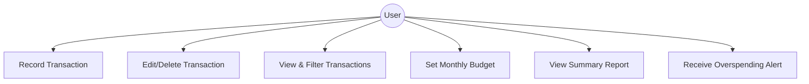

# SmartBudget

**SmartBudget** is a desktop application for personal finance
management. It helps users track expenses, set budgets, and gain
insights into their spending habits. Built with **Java** and **JavaFX**,
SmartBudget is designed to be simple, offline-friendly, and extensible
for future AI-powered features.

---

## Features

- **Expense & Income Tracking:** Record transactions quickly with
  categories and notes.
- **Budget Management:** Create monthly budgets and receive alerts
  when spending limits are approached.
- **Visual Reports:** See summaries and trends with charts and graphs.
- **Offline-First Design:** Works without an internet connection,
  ensuring privacy and accessibility.
- **Extensible Architecture:** Supports future integration of AI
  features like spending predictions and recommendations.

---

## UML Diagram



---

## Figma Prototype

- [Prototype Link](https://silk-stable-56694367.figma.site/)

---

# Project Setup

## Prerequisites

Before running SmartBudget, make sure you have:

### Required

- **Java JDK 21 or newer**
- **Git**

### Optional

- IntelliJ IDEA (recommended IDE)

---

## Clone the Repository

```bash
git clone <YOUR_REPOSITORY_URL>
cd smart-budget-personal-finance-tracker/app
```

> ⚠️ Important: The Maven project is located inside the `app/` folder.
> All build commands must be run from this directory.

---

## Maven Wrapper (Recommended)

This project includes the Maven Wrapper. This means you **do NOT need to
install Maven manually**.

The wrapper automatically downloads and uses the correct Maven version.

---

## Build and Run the Project

### Windows

```bash
./mvnw.cmd clean test
./mvnw.cmd javafx:run
```

### macOS / Linux

```bash
./mvnw clean test
./mvnw javafx:run
```

---

## Running Inside IntelliJ IDEA

1.  Open IntelliJ IDEA
2.  Select **Open Project**
3.  Choose the `app/` folder
4.  Allow IntelliJ to import the Maven project
5.  Ensure Project SDK is set to **JDK 21**
6.  Run:
    - `MainApp.java`
    - OR run Maven goal `javafx:run`

---

## Project Structure

    smart-budget-personal-finance-tracker
    │
    ├── app
    │   ├── src
    │   │   ├── main
    │   │   │   ├── java
    │   │   │   └── resources
    │   │   └── test
    │   │       └── java
    │   ├── pom.xml
    │   ├── mvnw
    │   ├── mvnw.cmd
    │   └── .mvn
    │
    ├── docs
    └── README.md

---

## Running Tests

### Windows

```bash
./mvnw.cmd test
```

### macOS / Linux

```bash
./mvnw test
```

---

## Code Coverage

JaCoCo is included for test coverage reports.

After running tests, coverage reports will be generated inside:

    app/target/site/jacoco/index.html

---

## Technologies Used

- Java 21
- JavaFX
- Maven
- Jackson (JSON persistence)
- JUnit 5
- JaCoCo (Code coverage)

---

## Future Improvements

- AI-powered spending prediction
- Smart budgeting recommendations
- Cloud sync support
- Enhanced reporting dashboards

---

## Contributing

1.  Create a new branch
2.  Make your changes
3.  Write or update tests
4.  Submit a pull request

---

## License

This project is for educational use.
